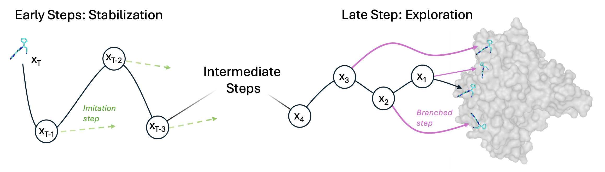

# Teaching Diffusion Models Physics: Reinforcement Learning for Physically Valid Diffusion-Based Docking

RLDiff is the official codebase for the paper, Teaching Diffusion Models Physics, available [here](https://www.biorxiv.org/content/10.64898/2026.03.25.714128v1). We provide a reinforcement learning framework for fine-tuning diffusion-based docking models with non-differentiable rewards, alongside inference code for our models DiffDock-Pocket RL and DiffDock-Pocket RL++, the latter incorporating Vina minimization and GNINA re-ranking.

Fine-tuned using the RLDiff reinforcement learning framework with PoseBusters validity checks as the reward, DiffDock-Pocket RL generates substantially more physically valid, near-native poses than the original DiffDock-Pocket and outperforms both classical docking methods and other ML-based approaches on the PoseBusters benchmark. As described in the paper, DiffDock-Pocket RL++ further improves performance across all success criteria.

---

## Inference

### 1. Installation

RLDiff is designed to be cloned inside DiffDock-Pocket:
```bash
git clone git@github.com:plainerman/DiffDock-Pocket.git
cd DiffDock-Pocket
git clone git@github.com:oxpig/RLDiff.git
cd RLDiff
```

Create and activate the conda environment:
```bash
conda env create -f inference_env.yml
conda activate RLDiff
```

#### GNINA (required for `--minimize_and_rerank`)

Download the GNINA binary, make it executable, and place it on your PATH:
```bash
wget https://github.com/gnina/gnina/releases/download/v1.0/gnina -O ~/bin/gnina
chmod +x ~/bin/gnina
export PATH="$HOME/bin:$PATH"
```

### 2. Prepare your dataset CSV

> **Note:** RLDiff supports proteins with cofactors and HETATM records. You do not need to strip them from your input PDB files before running inference. If cofactors are involved in binding, retaining them may improve pose quality.

From the `data/` directory, use `make_csv.py` to build an input CSV. It expects your dataset to have the structure:
```
{base_dir}/{cid}/{cid}_protein.pdb
{base_dir}/{cid}/{cid}_ligand.sdf
```

Pass any `.txt` file of complex IDs (one per line) via `--id_list`. This can be an absolute path, a relative path, or just a filename (resolved relative to the `data/` directory, where the bundled `posebusters_308_ids.txt` and `astex_diverse_85_ids.txt` live):
```bash
cd data/ # From RLDiff root

# To generate csv for running on PoseBusters
python make_csv.py \
  --base_dir /path/to/posebusters_benchmark_set \
  --id_list posebusters_308_ids.txt \
  --output posebusters_benchmark_df.csv

# To generate csv for running on Astex
python make_csv.py \
  --base_dir /path/to/astex_diverse_set \
  --id_list astex_diverse_85_ids.txt \
  --output astex_diverse_set_df.csv

# To generate a csv for your own data
python make_csv.py \
  --base_dir /path/to/my_dataset \
  --id_list /abs/path/to/my_ids.txt \
  --output my_input.csv
```

### 3. Run inference
```bash
cd ..  # (if you are still in /data, return to RLDiff root)

python inference.py \
  --protein_ligand_csv data/posebusters_benchmark_df.csv \
  --out_dir data/posebusters_test/ \
  --samples_per_complex 40 \
  --batch_size 5 \
  --num_workers 1 \
  --minimize_and_rerank \
  --minimize_workers 4 \
  --save_visualisation
```

| Argument | Description |
|---|---|
| `--protein_ligand_csv` | Path to input CSV from `make_csv.py` |
| `--out_dir` | Directory for output poses |
| `--samples_per_complex` | Number of candidate poses per complex (default: 40) |
| `--batch_size` | Complexes per inference batch |
| `--num_workers` | Set to the number of GPUs available (default: 1) |
| `--minimize_and_rerank` | Vina minimization + GNINA re-ranking (recommended) |
| `--minimize_workers` | Parallel workers for smina/GNINA post-processing (default: 4) |
| `--save_visualisation` | Save reverseprocess files for diffusion visualisation |

### 4. Analyse results

> **Note:** `analyse_my_results.py` expects the directory structure produced by `--minimize_and_rerank`.

Run PoseBusters evaluation over the minimized output poses:
```bash
python analyse_my_results.py \
  --minimized_root data/posebusters_test/minimized_poses/ \
  --inference_csv data/posebusters_benchmark_df.csv \
  --out_dir data/posebusters_results/ \
  --num_workers 8
```

| Argument | Description |
|---|---|
| `--minimized_root` | The `minimized_poses/` subdirectory produced by inference |
| `--inference_csv` | The input CSV used during inference (for protein/ligand paths) |
| `--out_dir` | Directory to write evaluation outputs |
| `--num_workers` | Number of parallel workers (default: 8) |
| `--top_k_oracle` | If set, oracle is computed over only the top K poses by GNINA score |

This writes four output files to `--out_dir`:

| File | Description |
|---|---|
| `pb_eval_per_pose.csv` | PoseBusters results for every individual pose |
| `pb_eval_per_complex.csv` | Per-complex Top-1 and Oracle aggregates |
| `pb_eval_one_line.csv` | Single-row summary for easy comparison across methods |
| `pb_eval_summary.json` | Full summary statistics as JSON |

---

## Training

### 1. Installation

Training requires a separate conda environment from inference:
```bash
conda env create -f training_env.yml
conda activate RLDiff_train
```

### 2. Download PDBBind

Download the PDBBind 2020 refined set from [pdbbind-plus.org.cn](https://pdbbind-plus.org.cn) (`PDBbind_v2020_refined.tar.gz`), then extract it into `RLDiff/data/`:
```bash
tar -xzf PDBbind_v2020_refined.tar.gz -C /path/to/DiffDock-Pocket/RLDiff/data/
# produces RLDiff/data/refined-set/
```

Training splits are already provided in `data/splits/`.

### 3. Configure and run training

Run training:
```bash
python train.py \
  --learning_rate 1e-4 \
  --branched_steps 8 \
  --branched_to 4 \
  --branches_per_t 2 \
  --samples_per_complex 4 \
  --num_complexes_to_sample 12 \
  --no_temp
```

| Argument | Description |
|---|---|
| `--learning_rate` | Learning rate (default: `1e-4`) |
| `--branched_steps` | Step to begin branching from (counting down from T to 0) |
| `--branched_to` | Step to stop branching at |
| `--branches_per_t` | Number of branches per step (default: `2`) |
| `--samples_per_complex` | Trajectories generated per complex per iteration |
| `--num_complexes_to_sample` | Number of complexes sampled per iteration |
| `--state_dict` | Path to a model checkpoint to resume from |
| `--no_temp` | Disable temperature during trajectory generation (recommended) |

### Customising the reward (optional)

To use a different reward signal, modify the `compute_rewards` function in `src/reward.py`.

---

## Citation
```bibtex
@misc{broster_teaching_2026,
  title={Teaching {Diffusion} {Models} {Physics}: {Reinforcement} {Learning} for {Physically} {Valid} {Diffusion}-{Based} {Docking}},
  author={Broster, James Henry and Popovic, Bojana and Kondinskaia, Diana and Deane, Charlotte M. and Imrie, Fergus},
  year={2026},
  month=mar,
  doi={10.64898/2026.03.25.714128},
  url={http://biorxiv.org/lookup/doi/10.64898/2026.03.25.714128}
}
```

---

## Acknowledgements

James Broster acknowledges funding from the Engineering and Physical Sciences Research Council (EPSRC) under grant EP/S024093/1 and from the Cambridge Crystallographic Data Centre through the SABS:R3 doctoral training programme. The authors acknowledge the use of resources provided by the Isambard-AI National AI Research Resource (AIRR).
